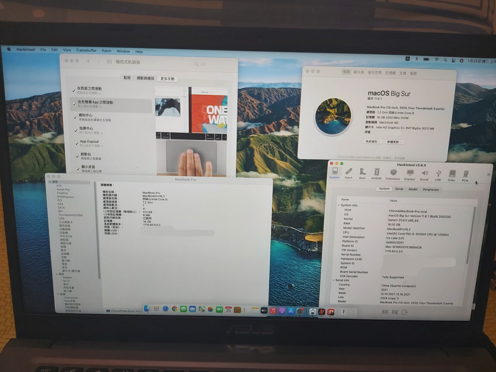

# Asus-laptop-X415JP-Hackintosh

## 🖥️Device
| Model | Asus Laptop X415JP |
|------------|-------------------------------|
| CPU | i5 1035G1(ice lake) |
| GPU | Intel UHD Garphics |
| RAM | 16GB |
| Audio | Realtek ALC256 |
| WIFI／Bluetooth | ~~RTL8821CE~~ --> DW1820A |
| BIOS Version | 303 |

## 📀System

|  |
|------------|
| <a href="https://support.apple.com/zh-tw/HT211896"> macOS BigSur 11.6.5 |
| <a href="https://github.com/acidanthera/OpenCorePkg/releases/tag/0.8.0">Opencore 0.8.0 |
| <a href="https://dortania.github.io/OpenCore-Install-Guide/extras/smbios-support.html#how-to-decide">MacBookPro16,2 | 

## 🛠️Setting BIOS
Advanced > Intel AES-NI：Disable

Advanced > SATA Configuration > SATA Mode Selection：AHCI

Boot > Fast Boot：Disable

Security > Secure Boot > Secure Boot Control：Disable

- CFG Lock：Disable,You need to use ControlMsrE2.efi or CFGLock.efi

                <key>Tools</key>
                <array>
                        <dict>
                                <key>Arguments</key>
                                <string>unlock</string>
                                <key>Auxiliary</key>
                                <true/>
                                <key>Comment</key>
                                <string></string>
                                <key>Enabled</key>
                                <true/>
                                <key>Name</key>
                                <string>ControlMsrE2</string>
                                <key>Path</key>
                                <string>ControlMsrE2.efi</string>
                                <key>RealPath</key>
                                <false/>
                                <key>TextMode</key>
                                <false/>
                        </dict>
                </array>
## 💡Device status
### Works：
- [x] Graphics
- [x] USB
- [x] Webcam
- [x] Brightness controls
- [x] Battery percentage
- [x] Sleep
- [x] TouchPad
- [x] WiFi
- [x] Speakers
- [x] Microphone
- [x] Bluetooth
### No Works：
- [ ] HDMI and HDMI Audio
### Unkown：
- [ ] Apple Services
## Noteice
- AppleALC not working from Windows reboot
